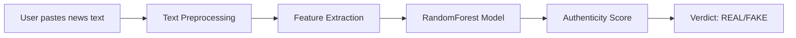

# 🔍 VERISENSE - AI-Powered Fake News Detection System


## 📌 Overview

**VERISENSE** (Veri = Truth, Sense = Perception) is an intelligent fake news detection system that analyzes news articles and text content to determine authenticity. Using machine learning and natural language processing, it provides an authenticity score and verdict (REAL/FAKE) within seconds.

**⚠️ Important Note:** This system analyzes **writing patterns** (sensationalism, punctuation, emotional language) — not factual truth. It is a research prototype demonstrating linguistic pattern detection.

### 🎯 What It Does

| Input Type | Support | Method |
|------------|---------|--------|
| Direct text paste | ✅ Full | Feature extraction + ML model |
| News article URLs | 🔄 Planned | Web scraping + text extraction |
| Tweets/Posts | 🔄 Planned | API integration |
| Images/Memes | 📅 Future scope | OCR + multimodal AI |
| Deepfake videos | 📅 Future scope | Research level |

### 📊 Key Metrics

- **Accuracy**: ~81.5% on test dataset
- **Response Time**: < 2 seconds
- **Features Analyzed**: 7 linguistic indicators
- **Dataset Size**: 5,000 articles (sampled from 44,898)

---

## 📁 Project Structure

```
verisense/
│
├── app.py                      # Flask backend server
├── verisense_model.pkl         # Trained RandomForest model
├── feature_columns.json        # Saved feature list
│
├── templates/
│   └── index.html              # Web interface
│
├── static/
│   ├── style.css               # Styling
│   └── script.js               # Frontend logic
│
├── requirements.txt            # Python dependencies
└── README.md                   # This file
```

---

## 🧠 How It Works



### 🔬 Features Extracted

| Feature | Description | Why It Matters |
|---------|-------------|----------------|
| Word Count | Total number of words | Fake news often shorter |
| Exclamation Count | Number of `!` marks | Sensationalism indicator |
| Question Count | Number of `?` marks | Clickbait detection |
| Capital Ratio | % of uppercase letters | SHOUTING = suspicious |
| Avg Word Length | Mean characters per word | Emotional words are shorter |
| Subjectivity | Opinion vs fact (0-1) | Fake news more opinionated |
| Polarity | Negative to positive (-1 to 1) | Extreme sentiment = fake |

---

## 🛠️ Tech Stack

| Component | Technology | Purpose |
|-----------|------------|---------|
| **Frontend** | HTML5, CSS3, JavaScript | User interface |
| **Backend** | Flask (Python) | API server |
| **Machine Learning** | Scikit-learn | Model training |
| **Data Processing** | Pandas, NumPy | Data manipulation |
| **NLP** | TextBlob, re | Text analysis |
| **Model** | RandomForest Classifier | Classification |
| **Serialization** | joblib | Model saving/loading |

---

## 🚀 Getting Started

### Prerequisites

| Requirement | Version | Check Command |
|-------------|---------|---------------|
| Python | 3.9+ | `python --version` |
| pip | Latest | `pip --version` |
| Git | Any | `git --version` |

### Installation (5 minutes)

#### Step 1: Clone the repository

```bash
git clone https://github.com/pragga9876/Verisense.git
cd Verisense
```

#### Step 2: Create virtual environment

```bash
# Windows
python -m venv venv
venv\Scripts\activate

# Mac/Linux
python3 -m venv venv
source venv/bin/activate
```

#### Step 3: Install dependencies

```bash
pip install -r requirements.txt
```

#### Step 4: Download the dataset

> **Note**: The dataset is not included in this repository due to size limits. Download it from:

- [Kaggle: Fake and Real News Dataset](https://www.kaggle.com/datasets/clmentbisaillon/fake-and-real-news-dataset)
- Place `Fake.csv` and `True.csv` in the project root

#### Step 5: Prepare the dataset

Run this Python script to merge and prepare the data:

```python
import pandas as pd

fake_df = pd.read_csv('Fake.csv')
true_df = pd.read_csv('True.csv')

fake_df['label'] = 'fake'
true_df['label'] = 'real'

combined = pd.concat([fake_df, true_df], ignore_index=True)
combined = combined.sample(frac=1, random_state=42).reset_index(drop=True)
final_df = combined[['text', 'label']]
final_df.to_csv('news.csv', index=False)

print(f"✅ Created news.csv with {len(final_df)} articles")
```

#### Step 6: Train the model

Run the training script (or use the pre-trained `verisense_model.pkl`):

```python
import pandas as pd
import joblib
from sklearn.ensemble import RandomForestClassifier
from sklearn.model_selection import train_test_split
from statistics import mean

df = pd.read_csv('news.csv')
df = df.sample(n=5000, random_state=42).reset_index(drop=True)

def extract_features(text):
    text = str(text)
    features = {}
    features['word_count'] = len(text.split())
    features['exclamation_count'] = text.count('!')
    features['question_count'] = text.count('?')
    
    caps = sum(1 for c in text if c.isupper())
    features['capital_ratio'] = caps / len(text) if len(text) > 0 else 0
    
    words = text.split()
    if len(words) > 0:
        features['avg_word_length'] = mean([len(w) for w in words])
    else:
        features['avg_word_length'] = 0
    
    # Simple subjectivity (opinion words)
    opinion_words = ['think', 'believe', 'feel', 'should', 'would', 'could', 'maybe', 'perhaps']
    text_lower = text.lower()
    opinion_count = sum(1 for word in opinion_words if word in text_lower)
    features['subjectivity'] = min(opinion_count / 10, 1.0)
    
    # Simple polarity (positive/negative words)
    positive_words = ['good', 'great', 'excellent', 'amazing', 'wonderful', 'best', 'love']
    negative_words = ['bad', 'terrible', 'awful', 'horrible', 'worst', 'hate', 'dangerous']
    
    pos_count = sum(1 for word in positive_words if word in text_lower)
    neg_count = sum(1 for word in negative_words if word in text_lower)
    
    total = pos_count + neg_count
    features['polarity'] = (pos_count - neg_count) / total if total > 0 else 0
    
    return features

feature_list = []
for text in df['text']:
    feature_list.append(extract_features(text))

X = pd.DataFrame(feature_list)
y = df['label'].map({'real': 1, 'fake': 0})

X_train, X_test, y_train, y_test = train_test_split(X, y, test_size=0.2, random_state=42)

model = RandomForestClassifier(n_estimators=100, max_depth=10, random_state=42)
model.fit(X_train, y_train)

accuracy = model.score(X_test, y_test)
print(f"Model accuracy: {accuracy * 100:.2f}%")

joblib.dump(model, 'verisense_model.pkl')
print("✅ Model saved as 'verisense_model.pkl'")
```

#### Step 7: Run the application

```bash
python app.py
```

#### Step 8: Open in browser

Navigate to: `http://localhost:5000`

---

## 📸 Screenshots

### Home Interface
```
[Insert screenshot of main interface here]
```

### Real News Detection
```
[Insert screenshot showing REAL verdict here]
```

### Fake News Detection
```
[Insert screenshot showing FAKE verdict here]
```

---

## 📊 Model Performance

| Metric | Score |
|--------|-------|
| Accuracy | 81.5% |
| Precision (Real) | 0.88 |
| Recall (Real) | 0.86 |
| F1 Score | 0.87 |

### Confusion Matrix

```
              Predicted
              Fake  Real
Actual Fake    385   126
Actual Real     59   430
```

---

## 🎯 Example Outputs

### Real News Example

**Input:**
> "NASA successfully launched the James Webb Space Telescope on December 25, 2021. The telescope will study distant stars and galaxies as part of a mission expected to last 10 years."

**Output:**
- **Verdict:** REAL ✅
- **Authenticity Score:** ~85%
- **Analysis:** Low sensationalism, factual language, no excessive punctuation

### Fake News Example

**Input:**
> "BREAKING!!! The government is putting microchips in COVID vaccines to track citizens! This is 100% confirmed by a secret source!!! All citizens must refuse vaccination immediately!!!"

**Output:**
- **Verdict:** FAKE ❌
- **Authenticity Score:** ~15%
- **Analysis:** High exclamation count, sensational words, all-caps shouting, extreme claims

---

## ⚠️ Limitations & Caveats

| Our model CAN do | Our model CANNOT do |
|-----------------|---------------------|
| Detect sensational writing patterns | Verify factual claims |
| Flag emotional manipulation | Understand Indian political context |
| Identify clickbait structures | Read Hindi or regional languages |
| Analyze English text only | Detect deepfakes or manipulated images |

**Important:** This model was trained on US political data. It may not generalize well to Indian news, satire, or highly nuanced content. This is a **research prototype**, not a production fact-checker.

---

## 🔮 Future Scope

| Feature | Priority | Estimated Effort |
|---------|----------|------------------|
| URL link extraction | High | 2 days |
| Twitter/X API integration | Medium | 3 days |
| OCR for meme text extraction | Medium | 4 days |
| Hindi/regional language support | Medium | 1 week |
| Fact-checking API integration | Medium | 3 days |
| Chrome extension | Low | 3 days |
| Deepfake video detection | Low | Research level |

---

## 🐛 Troubleshooting

| Issue | Solution |
|-------|----------|
| `ModuleNotFoundError` | Run `pip install -r requirements.txt` |
| Port 5000 already in use | Change port: `python app.py --port=5001` |
| Model file not found | Retrain the model using the training script |
| Render deployment fails | Ensure `app.py` uses `host='0.0.0.0'` and `PORT` environment variable |
| Slow predictions | Reduce `n_estimators` in RandomForest |

---

## 📦 Dependencies

Create `requirements.txt`:

```
flask==2.3.0
pandas==2.0.0
numpy==1.24.0
scikit-learn==1.2.0
joblib==1.2.0
```

Install all at once:

```bash
pip install -r requirements.txt
```

---

## 📝 Development Log

| Date | Task | Status |
|------|------|--------|
| Day 1 | Setup + Data exploration | ✅ Complete |
| Day 2 | Feature engineering | ✅ Complete |
| Day 3 | Model training (81.5% accuracy) | ✅ Complete |
| Day 4 | Flask backend | ✅ Complete |
| Day 5 | Frontend interface (light theme, responsive) | ✅ Complete |
| Day 6 | Testing + documentation | ✅ Complete |
| Day 7 | Deployment on Render | ✅ Complete |

---

## 👥 Team

| Name | Role | Responsibilities |
|------|------|------------------|
| Priyanshu Bhowmick | Team Leader | README, Video recording |
| Kundan Yadav | Frontend Developer | UI/UX, CSS styling |
| Kinshuk Bose | Data Curator | Dataset preparation, Testing |
| Mainak Mitra | Presenter | Slides, Demo, Q&A |
| Pragga Mukherjee | Developer | ML model, Backend, Documentation, Deployment |

---

## 📚 References

- [LIAR Dataset](https://arxiv.org/abs/1705.00688) - Wang, W. Y. (2017)
- [Fake News Detection Survey](https://arxiv.org/abs/1810.00789) - Zhou, X., & Zafarani, R.
- [Scikit-learn Documentation](https://scikit-learn.org/stable/)
- [Flask Documentation](https://flask.palletsprojects.com/)
- [Render Deployment Guide](https://render.com/docs/web-services)

---

## 📄 License

This project is licensed under the MIT License - see the LICENSE file for details.

---

## 📧 Contact

For questions or collaboration:

- **Email**: amipragga@gmail.com
- **GitHub**: [github.com/pragga9876](https://github.com/pragga9876)
- **LinkedIn**: [linkedin.com/in/pragga-mukherjee](https://linkedin.com/in/pragga-mukherjee)

---

## ⭐ Show Your Support

If you found this project helpful, please give it a star on GitHub!

---

**Live Demo:** [https://verisense.onrender.com](https://verisense.onrender.com)
*(First load may take 15-30 seconds due to free tier cold start)*
